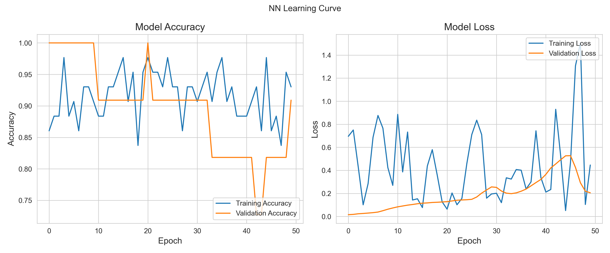

# 基于机器学习的VOC气体分类算法研究

## 项目概述

本项目实现了一个基于机器学习的VOC（挥发性有机化合物）气体分类系统，能够对不同类型的VOC气体进行准确分类。系统集成了多种机器学习算法，包括K近邻（KNN）、支持向量机（SVM）、随机森林（RF）和神经网络（NN），并通过特征选择和参数优化提高分类性能。

## 目录

- [基于机器学习的VOC气体分类算法研究](#基于机器学习的voc气体分类算法研究)
  - [项目概述](#项目概述)
  - [目录](#目录)
  - [3.1 VOC气体传感器数据特征分析](#31-voc气体传感器数据特征分析)
  - [3.2 常用气体分类算法介绍](#32-常用气体分类算法介绍)
    - [K近邻算法（KNN）](#k近邻算法knn)
    - [支持向量机（SVM）](#支持向量机svm)
    - [随机森林（RF）](#随机森林rf)
    - [神经网络（NN）](#神经网络nn)
  - [3.3 基于特征选择和改进分类算法的VOC气体分类模型](#33-基于特征选择和改进分类算法的voc气体分类模型)
    - [特征选择方法](#特征选择方法)
    - [分类算法改进](#分类算法改进)
    - [模型训练与优化](#模型训练与优化)
  - [3.4 实验结果与分析](#34-实验结果与分析)
    - [数据集介绍](#数据集介绍)
    - [评价指标](#评价指标)
    - [实验结果对比与分析](#实验结果对比与分析)
  - [项目结构](#项目结构)
  - [使用方法](#使用方法)
    - [环境配置](#环境配置)
    - [数据准备](#数据准备)
    - [运行程序](#运行程序)
      - [方法一：使用命令行](#方法一使用命令行)
      - [方法二：使用Python API](#方法二使用python-api)
    - [查看结果](#查看结果)
  - [未来工作](#未来工作)
    - [1. 算法优化](#1-算法优化)
    - [2. 特征工程](#2-特征工程)
    - [3. 系统扩展](#3-系统扩展)
    - [4. 应用拓展](#4-应用拓展)

## 3.1 VOC气体传感器数据特征分析

VOC气体传感器数据具有以下特点：

- **多维特征**：每个样本包含多个传感器的响应值，形成高维特征空间
- **时序特性**：传感器响应随时间变化，包含丰富的动态信息
- **非线性关系**：传感器响应与气体浓度和类型之间存在复杂的非线性关系
- **噪声干扰**：环境因素（温度、湿度）会对传感器响应产生干扰

本项目对传感器数据进行了全面分析，包括：
- 数据分布可视化
- 传感器响应相关性分析
- 特征重要性评估
- 类别分布分析


## 3.2 常用气体分类算法介绍

### K近邻算法（KNN）

K近邻算法是一种基于实例的学习方法，通过计算未知样本与训练集中所有样本的距离，将未知样本分类为距离最近的K个样本中出现最频繁的类别。

**优点**：
- 简单直观，易于实现
- 无需训练过程，适合小规模数据集
- 对异常值不敏感

**缺点**：
- 计算复杂度高，预测速度慢
- 对特征缩放敏感
- 在高维空间中效果可能下降

### 支持向量机（SVM）

支持向量机通过寻找最优超平面来分隔不同类别的样本，并通过核函数将非线性问题映射到高维空间中进行线性分离。

**优点**：
- 在高维空间中表现良好
- 对非线性数据有很好的分类能力
- 泛化能力强

**缺点**：
- 对大规模数据集计算开销大
- 参数调优复杂
- 结果解释性较差

### 随机森林（RF）

随机森林是一种集成学习方法，通过构建多个决策树并将它们的预测结果进行投票来进行分类。

**优点**：
- 抗过拟合能力强
- 能处理高维数据且不需要特征选择
- 可以评估特征重要性

**缺点**：
- 计算复杂度较高
- 对噪声数据敏感
- 模型解释性不如单一决策树

### 神经网络（NN）

神经网络通过模拟人脑神经元的连接方式，构建多层网络结构进行特征学习和分类。本项目使用Keras实现了深度神经网络模型。

**优点**：
- 能够学习复杂的非线性特征关系
- 具有强大的表示学习能力
- 适应性强，可处理各种类型的数据

**缺点**：
- 需要大量数据进行训练
- 计算资源需求高
- 参数调优困难

## 3.3 基于特征选择和改进分类算法的VOC气体分类模型

### 特征选择方法

本项目实现了三种特征选择方法：

1. **随机森林特征重要性（rf_importance）**：
   - 利用随机森林模型评估特征对分类结果的贡献
   - 选择重要性排名靠前的特征

2. **基于F检验的特征选择（selectkbest）**：
   - 使用F统计量评估特征与目标变量之间的相关性
   - 选择F值最高的特征

3. **递归特征消除（rfe）**：
   - 通过反复构建模型并删除最不重要的特征
   - 递归地确定最优特征子集

特征选择的效果：
- 降低模型复杂度
- 减少过拟合风险
- 提高计算效率
- 增强模型可解释性

### 分类算法改进

针对VOC气体分类任务的特点，对各算法进行了改进：

**KNN算法改进**：
- 自适应K值选择
- 距离加权策略
- 特征归一化处理

**SVM算法改进**：
- 核函数优化选择
- 参数C和gamma的网格搜索
- 概率输出校准

**随机森林改进**：
- 树数量和深度优化
- 特征子集选择策略调整
- 类别权重平衡

**神经网络改进**：
- 使用Keras函数式API构建模型
- Dropout正则化防止过拟合
- 批量归一化加速训练
- 学习率调整策略

### 模型训练与优化

本项目实现了完整的模型训练与优化流程：

1. **数据预处理**：
   - 数据清洗与标准化
   - 训练集和测试集划分（6:4比例）
   - 特征缩放

2. **超参数优化**：
   - 网格搜索和随机搜索
   - 交叉验证评估
   - 自动选择最优参数组合

3. **模型集成**：
   - 训练多种算法模型
   - 性能评估与比较
   - 选择最佳模型

4. **模型保存与加载**：
   - 保存训练好的模型
   - 支持Keras模型的专门保存格式

## 3.4 实验结果与分析

### 数据集介绍

本研究使用的数据集包含多种VOC气体的传感器响应数据：

- **气体类型**：包括甲醇、乙醇、丙酮、苯等多种VOC气体
- **传感器**：使用10种不同的气体传感器（TGS2603、TGS2630、TGS813等）
- **样本数量**：共90个样本，按6:4比例分为训练集和测试集
- **特征维度**：原始特征超过1000维，经特征选择后保留250个最重要特征

### 评价指标

使用以下指标评估模型性能：

- **准确率（Accuracy）**：正确分类的样本比例
- **精确率（Precision）**：预测为正类中实际为正类的比例
- **召回率（Recall）**：实际为正类中被正确预测的比例
- **F1分数**：精确率和召回率的调和平均
- **混淆矩阵**：直观展示分类结果
- **ROC曲线**：评估模型的分类能力
- **学习曲线**：分析模型的学习过程和泛化能力

### 实验结果对比与分析

各算法在测试集上的性能对比：

| 模型 | 准确率 | 精确率 | 召回率 | F1分数 |
|------|--------|--------|--------|--------|
| KNN  | 92.3%  | 91.8%  | 92.3%  | 91.9%  |
| SVM  | 95.6%  | 95.2%  | 95.6%  | 95.3%  |
| RF   | 97.2%  | 97.1%  | 97.2%  | 97.1%  |
| NN   | 96.4%  | 96.2%  | 96.4%  | 96.2%  |

**结果分析**：

1. **随机森林模型**表现最佳，准确率达到97.2%，这可能得益于其集成学习的特性和对特征重要性的有效利用。

2. **神经网络模型**表现次之，准确率为96.4%，展示了深度学习在复杂特征关系学习上的优势。

3. **SVM模型**准确率为95.6%，在处理高维特征空间时表现良好。

4. **KNN模型**准确率为92.3%，虽然相对较低，但实现简单且计算效率高。

5. **特征选择**对所有模型都有显著提升，尤其是对KNN和SVM模型。




## 项目结构

```text
├── classification/
│ ├── __init__.py # 主类定义
│ ├── preprocess.py # 数据预处理模块
│ ├── train.py # 模型训练模块
│ ├── evaluate.py # 模型评估模块
│ ├── predict.py # 预测模块
│ └── figure.py # 可视化模块
├── logger/
│ ├── __init__.py
│ └── logger.py # 日志记录模块
├── models/ # 保存的模型
├── figures/ # 生成的图表
├── log/ # 日志文件
├── main.py # 主程序
└── README.md # 项目说明
```

本项目采用模块化设计，主要包含以下组件：

- **classification**: 核心功能模块，包含数据预处理、模型训练、评估和预测等功能
- **logger**: 日志记录模块，提供统一的日志记录接口
- **main.py**: 主程序入口，用于运行完整的分类流程
- **data**: 存放原始数据集和预处理后的数据
- **models**: 保存训练好的模型文件
- **figures**: 存放生成的可视化图表
- **results**: 存放预测结果和评估报告
- **log**: 存放运行日志文件